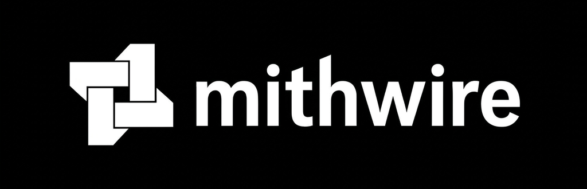

<p align="center">
  
</p>

<p align="center"><b>An anti-detect browser for Python.</b><br>
Drive real Chrome straight over the DevTools Protocol — no WebDriver, no Selenium, no chromedriver — with stealth and Cloudflare Turnstile solving built in.</p>

<p align="center">
  <a href="https://pypi.org/project/mithwire/"></a>
  <a href="https://pypi.org/project/mithwire/"></a>
  <a href="LICENSE.txt"></a>
  <a href="https://github.com/codeisalifestyle/mithwire-mcp"></a>
</p>

---

## What is mithwire?

**mithwire is an anti-detect browser automation framework.** It launches a normal
Chromium-based browser (Chrome, Brave, Edge…) and controls it by talking directly
to the [Chrome DevTools Protocol](https://chromedevtools.github.io/devtools-protocol/).
There is no automation driver bolted on the side — so the signals that anti-bot
systems look for to spot WebDriver/Selenium simply aren't there.

The result is a browser that behaves like a real one, an async API that is short
and pleasant to write, and the practical stealth fixes you actually need against
modern anti-bot stacks.

> **Looking to run a fleet of these from an AI agent?** See
> **[mithwire-mcp](https://github.com/codeisalifestyle/mithwire-mcp)** — an MCP server
> that gives LLM agents managed sessions, profiles, proxies, and fingerprint control
> over many mithwire browsers at once.

## Features

**Stealth & anti-detect**
- Talks raw CDP — **no `webdriver` flag, no chromedriver binary, no Selenium**
- Stays undetected against most common anti-bot solutions out of the box
- **Cloudflare Turnstile solving** via `tab.verify_cf()` — light *and* dark-mode widget templates bundled
- **HiDPI / Retina aware** — detects `devicePixelRatio` and returns correct CSS-pixel click coordinates
- Multi-template matching (best match wins) with configurable retries and human-like timing jitter
- Fresh, throwaway profile per run; cleans up after itself

**Automation ergonomics**
- Up and running in ~2 lines of async code, with best-practice defaults
- Smart element lookup by **text or selector**, including inside iframes — doubles as a wait condition
- `tab.find()`, `tab.find_all()`, `tab.select()`, `tab.select_all()`, `tab.xpath()`
- Cookies, localStorage, screenshots, multi-tab / multi-window, external debugger attach
- Descriptive element `__repr__` (renders as HTML), plus helpers for the operations you reach for most
- Fully asynchronous; works with Chrome, Chromium, Edge and Brave

## Install

```bash
pip install mithwire
```

You need a Chromium-based browser (Chrome/Brave/Edge) installed, ideally in the
default location. On a headless server, run under [`Xvfb`](https://en.wikipedia.org/wiki/Xvfb)
or use headless mode.

To upgrade:

```bash
pip install -U mithwire
```

## Quick start

```python
import mithwire as uc

async def main():
    browser = await uc.start()
    page = await browser.get("https://www.nowsecure.nl")
    await page.save_screenshot()

uc.loop().run_until_complete(main())
```

`uc.loop().run_until_complete(...)` is used instead of `asyncio.run(...)` for
reliable event-loop handling.

## Usage

### Custom launch options

```python
from mithwire import start

browser = await start(
    headless=False,
    user_data_dir="/path/to/profile",   # pass one and it won't be auto-cleaned on exit
    browser_executable_path="/path/to/some/other/browser",
    browser_args=["--some-flag=true"],
    lang="en-US",
)
tab = await browser.get("https://example.com")
```

Or configure via a `Config` object:

```python
from mithwire import Config

config = Config()
config.headless = False
config.user_data_dir = "/path/to/profile"
config.browser_args = ["--some-flag=true"]
```

### Finding things on the page

```python
# by text — returns the closest match by text length, not the first hit
accept = await tab.find("accept all", best_match=True)
await accept.click()

# by CSS selector (retries until found or <timeout>, so it doubles as a wait)
email = await tab.select("input[type=email]")
imgs = await tab.select_all("a[href] > div > img")

# by XPath
node = await tab.xpath("//button[contains(., 'Next')]", timeout=2.5)
```

### Solving Cloudflare Turnstile

```python
page = await browser.get("https://site-behind-turnstile.example")
await page.verify_cf(max_retries=3, timeout=20, retry_interval=2)
```

Bundled with light- and dark-mode widget templates and HiDPI-correct coordinates.
Requires `opencv-python` (`pip install opencv-python`).

### Handy tab helpers

| Method | Does |
| --- | --- |
| `tab.get_content()` | current page HTML |
| `tab.save_screenshot()` | screenshot to a temp file |
| `tab.scroll_down(n)` / `tab.scroll_up(n)` | scroll the page |
| `tab.get_local_storage()` / `tab.set_local_storage(dict)` | read/write localStorage |
| `tab.add_handler(event, cb)` | subscribe to CDP events (`cb(event)` or `cb(event, tab)`) |
| `tab.bypass_insecure_connection_warning()` | click through invalid-cert warnings |
| `tab.open_external_debugger()` | inspect a tab without breaking your connection |

A fuller, runnable script (automating account creation end to end) lives in the
[`example/`](example/) folder.

## How it compares

Most "stealth" tools either drive the browser through WebDriver/Selenium (which
leaks an obvious automation surface) or patch over it with injected JavaScript
(which is itself detectable). mithwire skips both: it speaks the browser's own
debug protocol directly, so there's no driver to fingerprint and no injected
shim to catch. You still get the full power of CDP when you need low-level control.

## mithwire-mcp — for AI agents

If you want **LLM agents to operate browsers** — spin up sessions, juggle
persistent identities, rotate proxies, and keep fingerprints consistent across a
whole fleet — use **[mithwire-mcp](https://github.com/codeisalifestyle/mithwire-mcp)**.
It's the Model Context Protocol access layer built on top of this engine.

## Credits & license

mithwire is a maintained fork of [**nodriver**](https://github.com/UltrafunkAmsterdam/nodriver)
by UltrafunkAmsterdam, itself the successor to undetected-chromedriver. It is
distributed under the **GNU AGPL-3.0**, the same license as upstream. Original
copyright and license are preserved in [`LICENSE.txt`](LICENSE.txt); attribution
details are in [`NOTICE`](NOTICE). mithwire is not affiliated with or endorsed by
the original author.

This fork addresses real-world limitations hit when running against modern
anti-bot systems; fixes land as they're discovered during active use.

> **Use responsibly.** Only automate sites and accounts you're authorized to use,
> respect Terms of Service and local law, and avoid abusive request rates.
