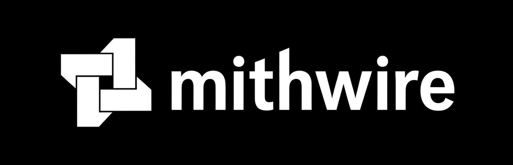

<p align="center">
  
</p>

<p align="center">
  <b>🔥 An advanced, production-ready anti-detect browser framework for Python.</b><br>
  Built with stealth at its core • CDP-Based • Dual-engine architecture<br>
  <b>No WebDriver / No ChromeDriver / No JS shims</b>
</p>

<p align="center">
  <a href="https://pypi.org/project/mithwire/"></a>
  <a href="https://pypi.org/project/mithwire/"></a>
  <a href="LICENSE.txt"></a>
  <a href="https://github.com/codeisalifestyle/mithwire-mcp"></a>
</p>

---


## 💡 What is Mithwire?

**Mithwire** is a next-generation anti-detect browser automation framework for Python designed specifically to bypass modern anti-bot protection systems.

Unlike traditional automation frameworks—such as **Playwright, Puppeteer, and Selenium**—which were built for software testing rather than stealth, Mithwire was architected from the ground up to operate completely undetected.

---


## 💥 The Problem with Traditional Automation

Standard browser automation frameworks leak obvious signatures that modern security systems (Cloudflare, Akamai, DataDome, Kasada, CreepJS, DAB) flag instantly:

- ❌ **WebDriver Footprints:** Drivers like ChromeDriver inject global variables (`navigator.webdriver = true`, `cdc_` window properties, `puppeteer_` / `playwright_` initialization signatures).
- ❌ **Detectable JS Patching:** "Stealth" plugins for Playwright/Puppeteer rely heavily on JavaScript monkey-patching (`Object.defineProperty`). Anti-bot scripts detect these by inspecting prototype chain anomalies, getter descriptors, and function `.toString()` strings.
- ❌ **Main-Thread Inconsistencies:** Injected JS shims only run on the main document. Web Workers, Service Workers, and outgoing HTTP headers leak the real, unpatched host environment—creating glaring lies that lie-detectors flag immediately.
- ❌ **VPS & Cloud Server Tell-tales:** Running on a Linux server or VPS exposes SwiftShader GPUs, minimal font sets, headless screen metrics, and STUN/WebRTC leaks that instantly betray server environments.

---


## 🛡️ The Mithwire Solution: Verified Stealth Superiority

Mithwire solves these challenges by eliminating automation drivers and monkey-patching altogether:

1. ⚡ **Direct CDP Control (Zero Driver):** Connects directly to Chromium via raw Chrome DevTools Protocol. There is no WebDriver binary, no `navigator.webdriver` flag, and no injected driver artifacts.
2. 🎯 **Engine-Level Overrides:** Applies fingerprint overrides (timezone, locale, languages, platform, user agent client hints) inside Chromium via CDP `Emulation.`* domains. Overrides propagate natively to Web Workers and HTTP headers—ensuring 100% internal consistency.
3. 🥷 **Dual Stealth Architecture:** Flexible choice between ultra-fast CDP automation and C++ source-level patched binaries (CloakBrowser) for deep hardware anti-detection.
4. 🔬 **Extensively Tested & Verified:** Rigorously benchmarked against CreepJS, deviceandbrowserinfo.com (DAB), Sannysoft, and real-world protected sites, achieving clean stealth scores across platforms.

---


## ⚡ Two Core Engines

Mithwire provides two execution modes depending on your fingerprinting requirements:

### 1. 🚀 CDP Mode (`nodriver` - Default)

- **Mechanism:** Launches standard Chromium-based browsers (Chrome, Brave, Edge) and controls them over raw CDP without a WebDriver.
- **Stealth Strategy:** Uses native CDP `Emulation` commands to set timezone, locale, geolocation, screen dimensions, user agent, client hints, and hardware concurrency directly inside Chromium.
- **Capabilities & Limitations:** Extremely reliable, lightweight, and fast. CDP mode can apply cross-OS user agents and platforms, but deeper analytics that inspect C++ level hardware primitives (e.g. SwiftShader GPU strings, native system fonts, AudioContext rendering curves) will still reflect the underlying host hardware.
- **When to use:** Default mode. Serves well for use cases where profiles can match host or cross-OS profiles where target sites have low/medium protection.


### 2. 🥷 Stealth Mode (Patched Binary / CloakBrowser)

- **Mechanism:** Swaps in a custom C++-patched Chromium binary ([CloakBrowser](https://github.com/CloakHQ/CloakBrowser)).
- **Stealth Strategy:** Modifies deep physical fingerprint surfaces (Canvas hash, WebGL vendor/renderer, AudioContext, system fonts, GPU strings, screen dimensions, TLS/JA3 fingerprints) directly at the C++ source code level before JavaScript executes.
- **When to Use:** Ideal for **cross-OS profiles** (e.g. presenting an authentic Windows or macOS profile from a Linux VPS) and bypassing advanced anti-bot detectors (CreepJS, DAB) that inspect low-level hardware primitives.

---


## 📊 Mode Comparison Matrix


| Feature / Capability                                  | 🚀 CDP Mode (`engine="cdp"`)                                   | 🥷 Stealth Mode (`engine="stealth"`)               |
| ----------------------------------------------------- | -------------------------------------------------------------- | -------------------------------------------------- |
| **Chromium Binary**                                   | Stock Chrome / Chromium / Edge / Brave                         | Patched CloakBrowser Binary                        |
| **Automation Driver**                                 | None (Raw CDP)                                                 | None (Raw CDP)                                     |
| `navigator.webdriver`                                 | `false` (Native)                                               | `false` (Native)                                   |
| **Timezone, Locale & Languages**                      | CDP Overrides (Natively in Workers)                            | CDP Overrides (Natively in Workers)                |
| **Geolocation Spoofing**                              | CDP Overrides + Permission Grant                               | CDP Overrides + Permission Grant                   |
| **User Agent & Client Hints**                         | CDP `Emulation` Overrides                                      | C++ Source Level                                   |
| **Same-OS Profiling (Linux on Linux, Mac on Mac)**    | ✅ Excellent                                                    | ✅ Excellent                                        |
| **Cross-OS Profiling (Windows/Mac profile on Linux)** | ⚠️ Works for basic/medium sites; hardware strings reflect host | ✅ Perfect (C++ patched GPU, fonts, UA, canvas)     |
| **Canvas & Audio Fingerprinting**                     | Host Native                                                    | C++ Seed-Randomized                                |
| **WebGL Vendor & Renderer**                           | JS / Profile Override                                          | C++ Seed-Randomized                                |
| **Font Enumeration & TLS Signature**                  | Host Native                                                    | C++ Source Level Patched                           |
| **Supported Operating Systems**                       | Linux, macOS, Windows                                          | Linux, macOS                                       |
| **Remote Linux / VPS Deployment**                     | ✅ Fully Supported (Same-OS or standard target sites)           | ✅ Fully Supported (Advanced cross-OS target sites) |


---


## ✨ Key Features at a Glance

- 🥷 **Stealth by Design:** Zero `navigator.webdriver`, no ChromeDriver, no Selenium, no detectable JS shims.
- ⚡ **Dual Stealth Engines:** Native CDP mode for fast same-OS automation, C++ patched binary for deep cross-OS hardware stealth.
- 🎭 **Comprehensive Fingerprint Control:** Precision control over timezone, locale, Accept-Language, geolocation, screen dimensions, DPR, touch points, platform, user agent, client hints, hardware concurrency, and device memory.
- 🔄 **Worker-Thread Consistency:** Overrides propagate natively to Web Workers, Service Workers, and outgoing HTTP headers—preventing main-vs-worker lie detection.
- 🔒 **WebRTC Leak Protection:** Built-in WebRTC STUN candidate filtering to prevent host physical IP leaks when proxied.
- 🌐 **Proxy Integration & Pre-Flight Check:** Built-in HTTP/HTTPS/SOCKS proxy support with local authenticating relay, pre-flight health validation, and auto-alignment of timezone/locale/geo to proxy exit IP.
- 🧩 **Cloudflare Turnstile Solver:** Built-in one-liner solver (`tab.verify_cf()`) with OpenCV coordinate calculation.
- 🧠 **Smart DOM Querying:** Find elements by text, CSS selector, or XPath; lookups retry automatically as wait conditions.
- 🛠️ **Full CDP & Network Access:** Intercept, inspect, and analyze network requests, console logs, cookies, and storage.

---


## 🎯 Primary Use Cases

- 🤖 **AI Agent Web Operations & Debugging:** Power autonomous web browsing, automation development, and debugging for AI agents (via [mithwire-mcp](https://github.com/codeisalifestyle/mithwire-mcp)).
- 🕵️ **Stealth Web Scraping:** Extract data from sites protected by Cloudflare, Akamai, DataDome, and Kasada.
- 👤 **Multi-Account & Social Operations:** Manage isolated browser profiles with dedicated proxies, fingerprints, and persistent cookies.
- 🧪 **E2E Testing & Prototyping:** Perform realistic end-to-end user flow testing without triggering security challenges.

---


## 🤖 Give Your AI Agents a Stealth Browser: Mithwire MCP


Looking to integrate browser automation directly into AI models like Claude or Cursor?

**[mithwire-mcp](https://github.com/codeisalifestyle/mithwire-mcp)** is a Model Context Protocol server built on Mithwire:

- 🛠️ **Develop & Debug Automations:** Hand over browser tasks to AI agents to build, test, and debug scripts autonomously with interactive DOM snapshots, console monitoring, and live noVNC viewing.
- 🎮 **MCP Tools:** `session_start`, `browser_navigate`, `browser_click`, `browser_type`, `browser_snapshot`, `browser_solve_cloudflare`.
- 👤 **Persistent Profiles & Proxy Registry:** Reusable identities with bound proxies and durable cookies.
- 🐳 **Docker-Ready:** Pre-packaged with Xvfb, CloakBrowser, and noVNC for visual debugging.

---


## 🚀 Installation

```bash
# Standard installation (includes CDP mode & BrowserForge fingerprint generator)
pip install mithwire

# Stealth mode (includes C++ patched CloakBrowser wrapper)
pip install "mithwire[stealth]"
```


### Requirements

- Python `>=3.10`
- A Chromium-based browser (Chrome, Brave, Edge, or CloakBrowser)

---


## 🎬 Quick Start

```python
import mithwire as uc

async def main():
    # Start browser in CDP mode
    browser = await uc.start()
    
    # Navigate to page
    page = await browser.get("https://nowsecure.nl")
    
    # Take screenshot
    await page.save_screenshot("nowsecure.png")

uc.loop().run_until_complete(main())
```

---


## 🔧 Detailed Usage & Configuration


### 1. Launching with Custom Options

```python
from mithwire import start

browser = await start(
    headless=False,
    user_data_dir="/path/to/profile",  # Persistent profile directory
    browser_args=["--disable-gpu"],
    lang="en-US",
)
tab = await browser.get("https://example.com")
```

Or using the `Config` builder:

```python
from mithwire import Config, start

config = Config(
    headless=True,
    engine="stealth",  # Use CloakBrowser patched binary
    webrtc_leak_protection="filter",
)
browser = await start(config=config)
```


### 2. Fingerprinting & Identity Spoofing

```python
from mithwire import Config, FingerprintConfig, start

fingerprint = FingerprintConfig(
    timezone_id="America/New_York",
    locale="en-US",
    languages=["en-US", "en"],
    user_agent="Mozilla/5.0 (Windows NT 10.0; Win64; x64) AppleWebKit/537.36 (KHTML, like Gecko) Chrome/136.0.0.0 Safari/537.36",
    platform="Win32",
    hardware_concurrency=8,
    device_memory=16,
)

config = Config(fingerprint=fingerprint)
browser = await start(config=config)
```


### 3. Finding and Interacting with Elements

```python
# Select element by text content (finds best match length)
button = await tab.find("Accept All Cookies", best_match=True)
await button.click()

# Select element by CSS selector (auto-retries until found or timeout)
email_input = await tab.select("input[name='email']")
await email_input.send_keys("user@example.com")

# Select element by XPath
submit_btn = await tab.xpath("//button[@type='submit']", timeout=5.0)
await submit_btn.click()
```


### 4. Solving Cloudflare Turnstile

```python
page = await browser.get("https://site-behind-turnstile.com")

# Solves Turnstile challenge with automatic retry and coordinate clicking
await page.verify_cf(max_retries=3, timeout=20)
```

*(Requires* `pip install opencv-python`*)*

---


## 📜 License & Acknowledgments

Mithwire is distributed under the **GNU AGPL-3.0** license.

Mithwire is a maintained, enhanced fork of **[nodriver](https://github.com/UltrafunkAmsterdam/nodriver)** by UltrafunkAmsterdam (the successor to `undetected-chromedriver`). Original copyright and license are preserved in `LICENSE.txt`.

Stealth mode uses [CloakBrowser](https://github.com/CloakHQ/CloakBrowser) for binary-level Chromium patching.

> **Disclaimer:** Mithwire is intended for authorized security research, testing, and web scraping. Please automate responsibly and respect website Terms of Service.

